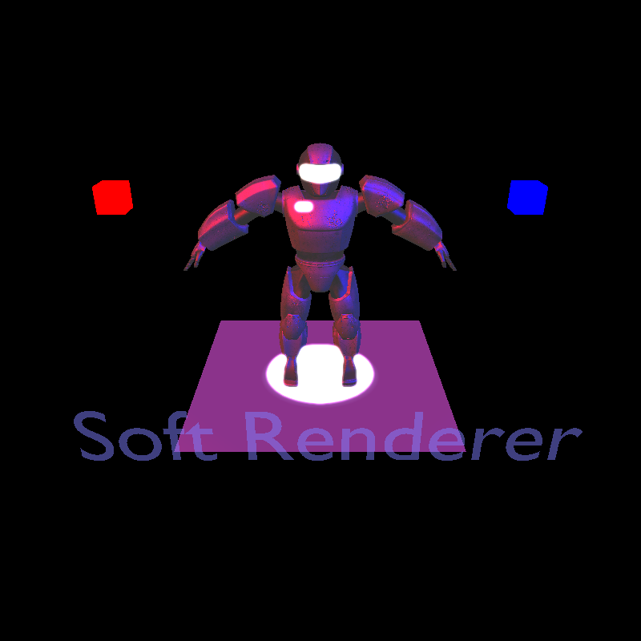

<p align="center">
  <a href="https://github.com/Buddhist-raspberry/SoftRenderer">
    
  </a>
  <h3 align="center">SoftRenderer</h3>
<p align="center">

</p>
  <p align="center">
    A soft-renderer built from scratch using C++ 11
  </p>

## About The Project

A soft-renderer built from scratch using C++ 11. The course project of computer graphics course in the School of Software (Media Arts and Sciences Direction) of Tongji University in the spring and summer semester of the 2020-2021. This project is supervised by Professor Jinyuan Jia. The dev team members are Kaibin Zhou, Jiajie Li, Xiaoyu Qi and Lai Ye.


## Built With

* [SDL2](https://www.libsdl.org/)：for GUI
* [GLM](https://github.com/g-truc/glm)：for mathematical operations
* [stb_image](https://github.com/nothings/stb)：for image operating
* [assimp](https://github.com/assimp/assimp)：for 3D model importing

## How To Run

```shell
mkdir build
cd build
cmake ..
make
cd bin
./13_GeneralScene
```

## Features

* Render Pipeline
* GUI
* A GLSL-like Shader
  * Vertex Shader
  * Fragment Shader
* Lighting model：
  * Phong Lighting Model
  * Diffuse Texture+Specular Texture+Bumped Normal Texture
* Transparent：
  * Alpha Test
  * Alpha Blend
* Light Source：
  * Directional Light
  * Point Light
  * Spot Light
  * Multi Light Source
* Shadow：
  * ShadowMap
* Postprocessing：
  * Bloom

## Reference

* Tinyrenderer：https://github.com/ssloy/tinyrenderer
* TinySoftRenderer：https://github.com/ZeusYang/TinySoftRenderer
* Modern OpenGL Tutorial：https://wiki.jikexueyuan.com/project/modern-opengl-tutorial/
* Learnopengl：https://learnopengl-cn.readthedocs.io/zh/latest/
* Unity Shader：https://github.com/candycat1992/Unity_Shaders_Book/tree/master/Assets/Shaders